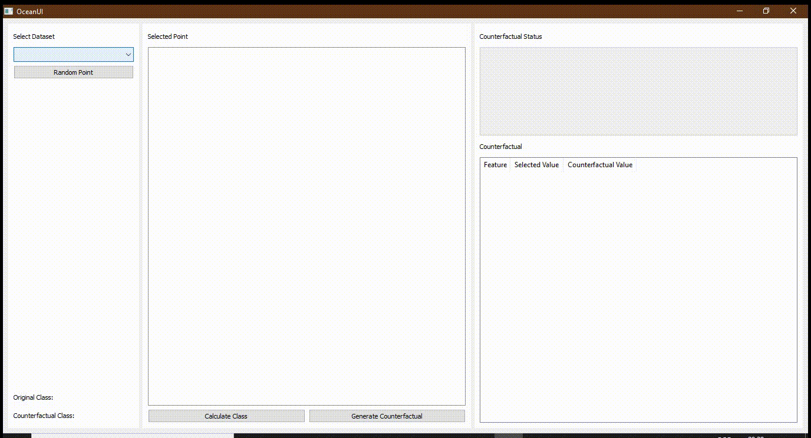

# INF2102-Project

This repository contains the INF2102 documentation and a link to the OCEAN GitHub repository with my contribution inside the folder “ui”.

Link: https://github.com/vidalt/OCEAN 

If the pull request has not yet been accepted, please use this link: https://github.com/MoisesHenr/OCEAN/tree/UI-implementation 

Follows a gif to show how the system works:

